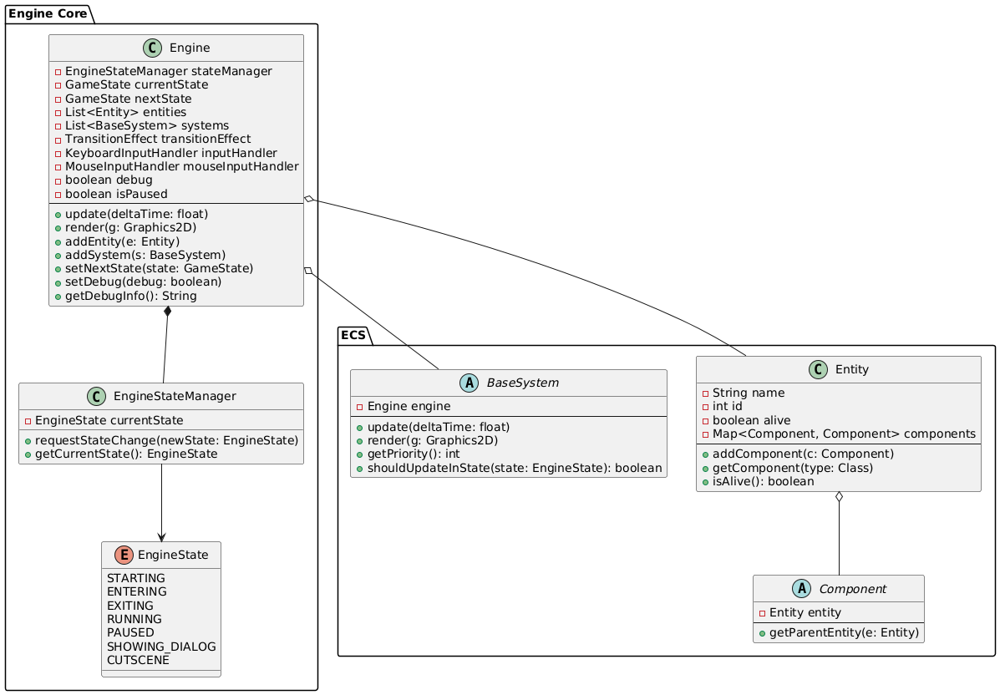

# Lezione 2

## Il Pattern ECS e la struttura del progetto

### Obiettivi
- Comprendere come è strutturato il progetto e in che modo il **pattern ECS** (Entity-Component-System) facilita la modularità.  
- Esaminare il ruolo di **`Engine`**, **`Entity`**, **`Component`** e **`BaseSystem`**.  
- Imparare a gestire l’associazione tra **entity** e **component** mediante `HashMap`.  
- Utilizzare `ArrayList` per memorizzare entity e system all’interno del motore di gioco.  
- Approfondire i meccanismi thread-safe per l’inserimento, la rimozione e la scansione di entity e system.

---

## 1. Introduzione alla struttura del progetto
Nella lezione precedente abbiamo visto come `MainECS` si occupi di avviare il gioco, creando la finestra (`GamePanel`) e il motore di gioco (`Engine`). In questa lezione, ci focalizziamo sulla **struttura interna** dell’engine, dove risiede l’**architettura ECS**:  
- **Entity**: oggetti del gioco (personaggi, proiettili, NPC, ecc.).  
- **Component**: dati specifici associati alle entità (es. posizione, sprite, statistiche di salute, ecc.).  
- **System**: logica che elabora determinate componenti (es. sistema di movimento, sistema di rendering, AI, fisica, ecc.).  

Questa suddivisione risulta utile per la **modularità** e la **riutilizzabilità**: ogni entità è definita dalla combinazione di componenti che la caratterizzano, mentre i sistemi contengono la logica che opera su quelle componenti.

---

## 2. Organizzazione del codice e risorse

La struttura tipica di un progetto ECS è la seguente (indicativa):

```
root/
├─ src/
│   ├─ engine/
│   │   ├─ Engine.java       // Gestisce l’insieme di entità e sistemi
│   │   ├─ Entity.java       // Classe che rappresenta un’entità
│   │   ├─ Component.java    // Classe astratta base per i componenti
│   │   ├─ BaseSystem.java   // Classe astratta da cui derivano i vari sistemi
│   │   ├─ systems/          // Package con le classi dei sistemi (MovementSystem, RenderSystem, ecc.)
│   │   └─ components/       // Package con le classi ddei componenti (MotionComponent, KeyInputComponent, ecc.)
│   ├─ enums/
│   │   ├─ EntityType.java   // Enum per definire i tipi di Entity
│   │   └─ …
│   ├─ main/
│   │   ├─ MainECS.java      // Punto di ingresso dell’applicazione
│   │   ├─ GamePanel.java
│   │   └─ …
│   └─ …
├─ res/                      // Risorse grafiche (immagini, sprite sheet, ecc.)
└─ …
```

---

## 3. Introduzione al Pattern ECS

Il pattern ECS è un potente paradigma di progettazione utilizzato nello sviluppo di videogiochi. ECS preferisce usare l’aggregazione rispetto all’ereditarietà per una maggiore flessibilità del codice. Supponiamo di avere un videogioco con diversi tipi di personaggi, ognuno con le sue caratteristiche uniche, per esempio il guerriero e il mago. Si potrebbe iniziare a scrivere la classe base Character e poi estenderla per i tipi specifici. Quando si vuole creare un nuovo personaggio che abbia le caratteristiche sia di un guerriero sia di un mago, però, l'approccio basato sull'ereditarietà diventa problematico. L'ereditarietà multipla non è supportata in Java, e l'utilizzo di interfacce o classi astratte per aggirare questo limite introduce complessità aggiuntiva e codice boilerplate, cioè sezioni di codice che devono essere copiate così come sono o con pochissime modifiche nelle diverse classi. In sintesi, usando l’ereditarietà:
1. Specializzare comportamenti o caratteristiche porta a gerarchie di classi rigide. Modificare l'implementazione o estendere le capacità richiede spesso modifiche a cascata nelle classi derivate, rendendo difficile adattare il comportamento degli oggetti a runtime.
2. Le classi sono strettamente accoppiate, rendendo difficile riutilizzare le caratteristiche specifiche senza ereditare anche comportamenti non necessari. La manutenzione diventa più complessa con l'aumentare della profondità della gerarchia di ereditarietà.
3. La gestione delle variazioni di comportamento e di stato porterebbe a un'enorme quantità di sottoclassi per coprire tutte le combinazioni possibili, complicando la base di codice e rendendo il sistema difficile da comprendere e estendere.
4. Gli oggetti creati attraverso l'ereditarietà tendono a essere più sparsi in memoria, potenzialmente peggiorando l'uso della cache della CPU e riducendo le performance, specialmente in sistemi dove l'aggiornamento di molti oggetti è critico, come nei videogiochi.

Usando ECS, invece:
1. Le entità sono aggregate dinamicamente con componenti per definire il loro comportamento e stato. Questo permette una aggregazione flessibile, dove le caratteristiche di un oggetto possono essere aggiunte, rimosse o modificate a runtime senza dover cambiare la gerarchia di classi.
2. I componenti possono essere riutilizzati tra diverse entità, promuovendo il riutilizzo del codice. La separazione della logica di gioco nei sistemi, che operano su componenti, facilita anche la manutenibilità poiché le modifiche a un sistema o componente hanno meno probabilità di influenzare altre parti del codice.
3. Si possono combinare componenti in modi nuovi e interessanti senza la necessità di creare nuove classi per ogni possibile combinazione. Ciò riduce significativamente il numero di classi necessarie.
4. Si possono avere miglioramenti delle performance, specialmente nei videogiochi, grazie alla sua natura orientata ai dati. I sistemi possono essere progettati per iterare sugli array di componenti in modo contiguo, ottimizzando l'uso della cache della CPU e riducendo i cache miss.

### Concetti chiave
- **Entity**: Le entità sono oggetti leggeri identificati da ID unici, dei contenitori per i componenti.
- **Component**: I componenti sono contenitori di dati puri associati alle entità. **Niente logica**.
- **System**: I sistemi gestiscono la logica del gioco operando sulle entità che contengono specifici componenti.

### Vantaggi
- **Modularità**
- **Riutilizzabilità**
- **Di facile manutenzione**

---

## 4. Panoramica delle classi principali

### 4.1 `Entity.java`

La classe Entity rappresenta gli oggetti di gioco, come i giocatori, i nemici, o gli oggetti. Ogni Entity possiede:
- un identificativo unico (id);
- un tipo (EntityType);
- uno stato alive per gestire la sua esistenza nel gioco;
- un attributo layer che indica la priorità di rendering;
- una mappa di componenti che definiscono le sue caratteristiche e comportamenti.

Ogni istanza della classe Entity riceve automaticamente un ID univoco grazie all’utilizzo dell’attributo statico idCount. Questo contatore statico viene incrementato a ogni creazione di una nuova entità, garantendo che ciascuna Entity abbia un ID progressivo e distinto.

I metodi addComponent, removeComponent e getComponent permettono di modificare dinamicamente le capacità e i comportamenti delle entità aggiungendo, rimuovendo, o accedendo ai loro componenti.

```java
public class Entity {
    private String name;
    private static int idCount = 1;
    private int id;
    private EntityType type;
    private int layer;
    private boolean alive;
    private HashMap<Class<? extends Component>, Component> components = new HashMap<>();

	  public Entity(EntityType type, int layer) {
		    this.id = idCount++;
		    this.type = type;
		    this.layer = layer;
		    components = new HashMap<>();
		    alive = true;
	  }

    public <T extends Component> void addComponent(T component) {
        components.put(component.getClass(), component);
    }

    public <T extends Component> T getComponent(Class<T> compClass) {
        return compClass.cast(components.get(compClass));
    }
}
```
I tipi di Entity sono definiti dall'enum EntityType.

```java
public enum EntityType {
    PLAYER,
    ITEM,
    NPC,
    ENEMY,
    PROJECTILE,
    TILEMANAGER,
    BACKGROUND,
    UI,
}
```
La sintassi ```<T extends Component>``` è un uso dei Generics in Java, che permette di scrivere codice più generico e riutilizzabile, limitando allo stesso tempo i tipi che possono essere utilizzati con una classe o un metodo. Nello specifico:
- ```<T```: Questo indica che si sta definendo un parametro di tipo generico T. È una convenzione chiamare il parametro di tipo generico con una singola lettera maiuscola. T sta per "Type".
- ```extends Component>```: Questa parte specifica che il tipo T deve essere Component o una sua sottoclasse. In pratica, ciò restringe l'uso di T ai tipi che sono compatibili con Component. Questo è noto come bounding del tipo.

Quando usiamo ```<T extends Component>``` nella definizione di un metodo, come in ```addComponent(T component)```, stiamo dicendo che il metodo accetta un parametro di qualsiasi classe che estende Component. ```Class<T>``` è invece un oggetto che rappresenta le informazioni su di una classe (per semplicità il tipo di classe) durante l’esecuzione. Ogni classe caricata dal classloader ha un'istanza corrispondente di Class che descrive il tipo della classe, incluse informazioni come il nome della classe, i suoi metodi, campi, annotazioni, superclassi, interfacce implementate, ecc. Ad esempio, un'istanza di ```Class<String>``` rappresenta le informazioni di tipo per la classe String. 

Nell'ambito del pattern ECS, ```Class<T>``` viene utilizzato come chiave per mappare i tipi di componenti alle loro istanze. Questo utilizzo sfrutta due aspetti importanti di ```Class<T>```:
- **Identificatore Unico**: Ogni classe in Java ha un unico oggetto Class associato. Ciò significa che possiamo usare Class come identificatore univoco in una mappa per rappresentare i diversi tipi di componenti.
- **Tipo Sicuro**: Utilizzando ```Class<T>``` come chiave, possiamo assicurarci che il tipo di componente che stiamo recuperando dalla mappa sia del tipo corretto, grazie ai generics. Questo previene errori di casting a runtime e migliora la sicurezza.

Nella classe Entity, la scrittura ```Map<Class<? extends Component>, Component>``` è utilizzata per memorizzare i componenti associati a un'entità. Una mappa in Java memorizza coppie chiave-valore e consente di recuperare, aggiungere o rimuovere valori rapidamente utilizzando la chiave. La sintassi ```Map<tipoChiave, tipoValore>``` prevede due parametri di tipo: il tipo della chiave e il tipo del valore. ```Class<? extends Component>``` viene usato come tipo della chiave. Come detto in precedenza, Class rappresenta le informazioni su una classe durante l’esecuzione dell’applicazione. L'uso della chiave ```Class<? extends Component>``` permette di usare il tipo della classe che estende Component come identificatore univoco per la classe stessa nella mappa. Il tipo del valore è ovviamente Component o una delle sue sottoclassi. In sintesi: ogni chiave, rappresentata dal tipo della classe, è mappata a un'istanza della classe stessa, che deve estendere Component. Questo approccio garantisce che ogni tipo di componente possa essere associato univocamente a un'entità.

L’HashMap è una struttura dati che implementa l'interfaccia Map di Java. L'uso di un HashMap per memorizzare i componenti di un'entità offre diversi vantaggi:
- **Accesso in un tempo costante**: L'HashMap fornisce, in media, accesso, inserimento e rimozione in un tempo che non dipende dal numero di oggetti contenuti, come per esempio nella ricerca semplice in un array, rendendolo efficiente per operazioni frequenti sui componenti.
- **Sicurezza sul tipo di classe**: Utilizzando generics, l'HashMap garantisce che solo i componenti del tipo corretto possano essere aggiunti o recuperati, prevenendo errori a runtime.
- **Flessibilità**: Permette di aggiungere o rimuovere componenti da un'entità in modo dinamico a runtime, offrendo grande flessibilità nel gestire lo stato e il comportamento delle entità nel gioco.


### 4.2 `Component.java`

Component è una classe astratta che definisce i dati o lo stato associato a una Entity. Ogni componente specifico (posizione, salute, velocità, ecc.) estenderà questa classe astratta, fornendo i dati necessari per un particolare aspetto o funzionalità dell'entità. Al costruttore viene passata l'Entity a cui appartiene il Component, per poterla recuperare successivamente e accedere agli altri componenti. 

```java
public abstract class Component {
    protected Entity entity;

    public Component(Entity entity) {
        this.entity = entity;
    }

    public Entity getParentEntity() {
        return entity;
    }
}
```

### 4.3 `BaseSystem.java`

BaseSystem è una classe astratta che rappresenta i sistemi nel pattern ECS. Ogni sistema concreto estenderà questa classe per implementare la logica specifica di aggiornamento (update) e di rendering (render). I sistemi possono essere ordinati o prioritizzati in base al campo priority, consentendo un controllo fine sull'ordine di aggiornamento e rendering. Il metodo che si occupa del rendering prende come parametri anche le coordinate x e y dell’offset, che serve a stabilire la porzione della mappa che deve essere disegnata sullo schermo. Il metodo update, invece, prende come parametro l'intervallo di tempo trascorso dal precedente update.

```java
public abstract class BaseSystem {
	protected Engine engine;
	protected int priority;
	public BaseSystem(Engine engine, int priority) {
		super();
		this.engine = engine;
		this.priority = priority;
	}
	public abstract void render(Graphics2D g, int xOffset, int yOffset);
	public abstract void update(float deltaTime);
	public int getPriority() {
		return priority;
	}
}
```
## 4.4 `EngineState.java`

L'enum `EngineState` rappresenta **i vari stati globali** in cui può trovarsi il motore di gioco (`Engine`).  
Ogni stato ha un significato specifico e regola quali sistemi o interazioni sono attivi nel ciclo di gioco.

```java
public enum EngineState {
    STARTING,
    ENTERING,
    EXITING,
    RUNNING,
    PAUSED,
    SHOWING_DIALOG,
    CUTSCENE
}
```

### Significato degli stati:

| Stato             | Descrizione |
|-------------------|-------------|
| `STARTING`        | Stato iniziale del motore dopo l’avvio. |
| `ENTERING`        | Transizione in ingresso verso un nuovo `GameState` (es. animazione fade-in). |
| `EXITING`         | Transizione in uscita dal `GameState` attuale (es. salvataggio, animazione fade-out). |
| `RUNNING`         | Stato operativo principale del gioco: il gioco è attivo e giocabile. |
| `PAUSED`          | Stato in cui il gioco è temporaneamente sospeso (es. menu pausa). |
| `SHOWING_DIALOG`  | Stato in cui viene mostrata una finestra di dialogo o interazione modale. |
| `CUTSCENE`        | Stato speciale per scene animate/scriptate non interattive. |

---

## 4.5 `EngineStateManager.java`

La classe `EngineStateManager` ha il compito di **gestire lo stato corrente del motore** e di **validare le transizioni** tra stati secondo regole predefinite.

```java
public class EngineStateManager {
    private EngineState currentState;
    private final Map<EngineState, Set<EngineState>> validTransitions;
}
```

### Funzionalità principali

#### Inizializzazione con stato iniziale

```java
new EngineStateManager(EngineState.STARTING)
```

Viene creato con uno stato iniziale (`STARTING`, di default) e una mappa delle transizioni valide tra stati.

---

### Transizioni valide

Nel metodo `initializeValidTransitions()` vengono definite le **transizioni ammesse** da uno stato all'altro.  
Esempio: dallo stato `RUNNING` si può passare a `PAUSED`, `SHOWING_DIALOG`, `CUTSCENE` o `EXITING`.

Queste regole vengono salvate in una mappa:

```java
Map<EngineState, Set<EngineState>> validTransitions
```

---

### Cambio di stato

Per cambiare stato, si usa:

```java
requestStateChange(EngineState newState)
```

Il metodo verifica che la transizione sia permessa, e solo in quel caso cambia `currentState`.  
Le transizioni non valide vengono bloccate e loggate.

---

### Metodo di verifica

Internamente usa:

```java
private boolean canTransitionTo(EngineState newState)
```

Per controllare che `newState` sia presente nell’insieme delle transizioni ammesse dallo stato attuale.

---

### Recuperare lo stato attuale

```java
EngineState getCurrentState()
```

Restituisce lo stato corrente del motore.

---

## Esempio di utilizzo

```java
EngineStateManager manager = new EngineStateManager(EngineState.STARTING);
manager.requestStateChange(EngineState.ENTERING); // valida
manager.requestStateChange(EngineState.CUTSCENE); // non valida → log di errore
```

# 4.6 `Engine.java`

La classe `Engine` è il cuore del framework ECS. Gestisce:

- Le **entità** (`Entity`), ovvero gli oggetti del gioco.
- I **sistemi** (`BaseSystem`), che implementano la logica.
- Il **ciclo di vita** del gioco (stati, transizioni, inizializzazione, cleanup).
- Gli **input** da tastiera e mouse.
- Le **transizioni tra stati di gioco** tramite `TransitionEffect`.
- La **gestione sicura e concorrente** di entità e sistemi tramite sezioni `synchronized`.

### Stato e transizioni

L'engine tiene traccia dello stato attuale (`currentState`) e di quello futuro (`nextState`). Le transizioni sono gestite con oggetti `TransitionEffect`, per animazioni in entrata/uscita.

### Gestione entità

Le entità attive sono contenute in un `ArrayList` `entities`. Per evitare problemi durante l'iterazione (modifica concorrente), vengono utilizzate due liste aggiuntive:

- `entitiesToAdd` per le entità in attesa di essere aggiunte.
- `entitiesToRemove` per quelle marcate come morte (`!isAlive()`).

### Gestione sistemi

I sistemi vengono ordinati per **priorità** tramite un comparatore (`systemComparator`). Ogni sistema dichiara in quali stati deve aggiornarsi.

### Input

I riferimenti a `KeyboardInputHandler` e `MouseInputHandler` sono passati tramite costruttore e recuperabili con getter pubblici.

---

## Scheletro della classe `Engine`

```java
public abstract class Engine {
    // === Gestione Stati ===
    private final EngineStateManager stateManager;
    private GameState currentState, nextState;

    // === Entità e Sistemi ===
    private final List<Entity> entities = new ArrayList<>();
    private final List<Entity> entitiesToRemove = new ArrayList<>();
    private final List<Entity> entitiesToAdd = new ArrayList<>();
    private final List<BaseSystem> systems = new ArrayList<>();
    private final Comparator<BaseSystem> systemComparator;

    // === Input ===
    private final KeyboardInputHandler inputHandler;
    private final MouseInputHandler mouseInputHandler;

    // === Transizioni e Debug ===
    private TransitionEffect transitionEffect;
    private boolean debug = false;

    // === Costruttore ===
    public Engine(KeyboardInputHandler inputHandler, MouseInputHandler mouseInputHandler) {
        ...
    }

    // Metodo da implementare per l'inizializzazione personalizzata
    protected abstract void init();

    // === Ciclo di aggiornamento ===
    public void update(float deltaTime) {
        ...
    }

    public void render(Graphics2D g) {
        ...
    }

    // === Gestione Stati ===
    private void switchState() { ... }
    private void handleTransition(float deltaTime) { ... }

    // === Gestione Entità ===
    private void removeDeadEntities() { ... }
    public void addEntity(Entity entity) { ... }

    // === Gestione Sistemi ===
    public void addSystem(BaseSystem system) { ... }

    // === Accesso e Utility ===
    public void accessEntities(Consumer<List<Entity>> action) { ... }
    public <T extends Component> void accessEntitiesWithComponent(...) { ... }
    public void sortEntities(Comparator<Entity> comparator) { ... }

    // === Input e Stato ===
    public KeyboardInputHandler getInputHandler() { ... }
    public MouseInputHandler getMouseInputHandler() { ... }
    public GameState getGameState() { ... }
    public EngineStateManager getStateManager() { ... }

    // === Debug e Pulizia ===
    public boolean isDebug() { ... }
    public void setDebug(boolean debug) { ... }
    public String getDebugInfo() { ... }
    public void cleanup() { ... }

    // === Focus finestra ===
    public void windowFocusLost() { ... }
    public void windowGainedFocus() { ... }
}
```

---

## Approfondimento: Ruolo e Funzionalità Principali

La classe astratta `Engine` è una struttura flessibile che consente di personalizzare il progetto a seconda delle necessità. I metodi principali sono:

- **Metodo `init` astratto**: Serve come punto di ingresso per configurare l'engine prima che inizi l'esecuzione del gioco. Ogni sottoclasse concreta di `Engine` deve implementare questo metodo per impostare le condizioni iniziali, come la preparazione dello stato iniziale del gioco.

- **Gestione dello Stato**: `Engine` gestisce gli stati di gioco tramite le variabili `currentState` e `nextState`, consentendo transizioni fluide tra diversi stati, come menu principale, gioco in corso e menu di pausa.

- **Cambio di Stato**: Il metodo `setNextState(GameState nextState)` permette di programmare il cambio di stato del gioco alla successiva chiamata del metodo `update`, assegnando un valore all’attributo `nextState`. Impostando `inputEnabled` a `false`, si previene la gestione degli input durante la transizione, evitando possibili conflitti o comportamenti indesiderati mentre lo stato corrente viene pulito (`cleanup`) e il nuovo stato inizializzato (`init`).

- **Aggiunta e Rimozione di Entity**: Le entità da aggiungere sono accumulate in `entitiesToAdd` e poi effettivamente aggiunte all'elenco delle entità attive all'inizio di ogni ciclo di aggiornamento per evitare problemi di concorrenza. Le entità non più "vive" vengono rimosse automaticamente tramite `removeDeadEntities()`.

- **Aggiunta di Sistemi**: I sistemi vengono aggiunti alla lista `systems` e ordinati in base alla loro priorità (tramite `systemComparator`), garantendo che la logica di gioco venga eseguita nell'ordine corretto.

- **Rendering con Camera**: Nel metodo `render`, l'engine può utilizzare la Camera (se implementata) per determinare quale parte del mondo di gioco visualizzare, supportando giochi open world e ambienti dinamici.

- **Gestione dell'Input**: `Engine` fornisce accesso agli handler per tastiera e mouse. In un’implementazione completa, può delegare la gestione degli eventi allo `GameState` corrente, se l'input è abilitato, permettendo una risposta personalizzata a seconda del contesto di gioco.

- **Gioco in pausa**: Il metodo `isPaused()` fornisce uno stato booleano che indica se il gioco è attualmente in pausa. Quando il gioco è in pausa, il metodo `update` non viene eseguito. Il metodo `setPaused(boolean isPaused)` permette di mettere in pausa o riprendere il gioco cambiando il valore della variabile `isPaused`. Questo può essere attivato, ad esempio, alla pressione del tasto pausa o quando la finestra perde il focus. 

## Diagramma delle classi


[Visualizza il sorgente PlantUML](engine.puml)
